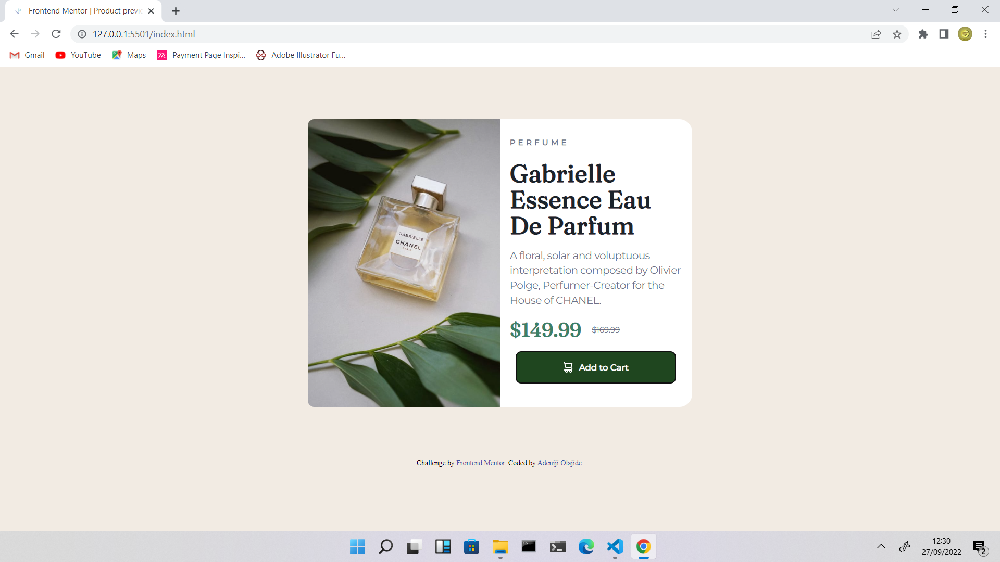
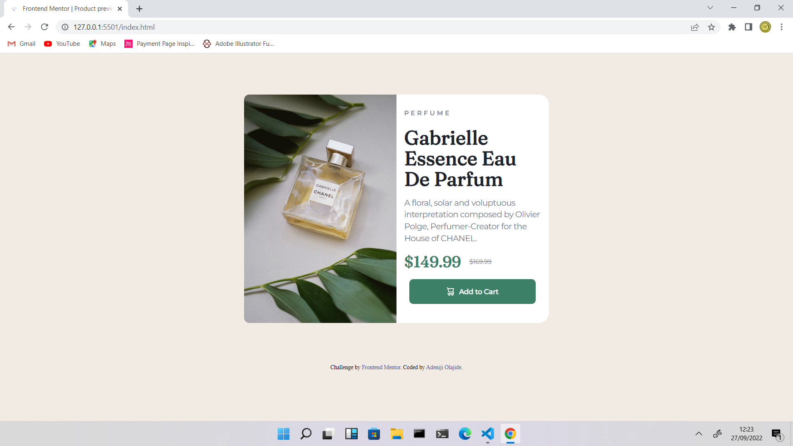
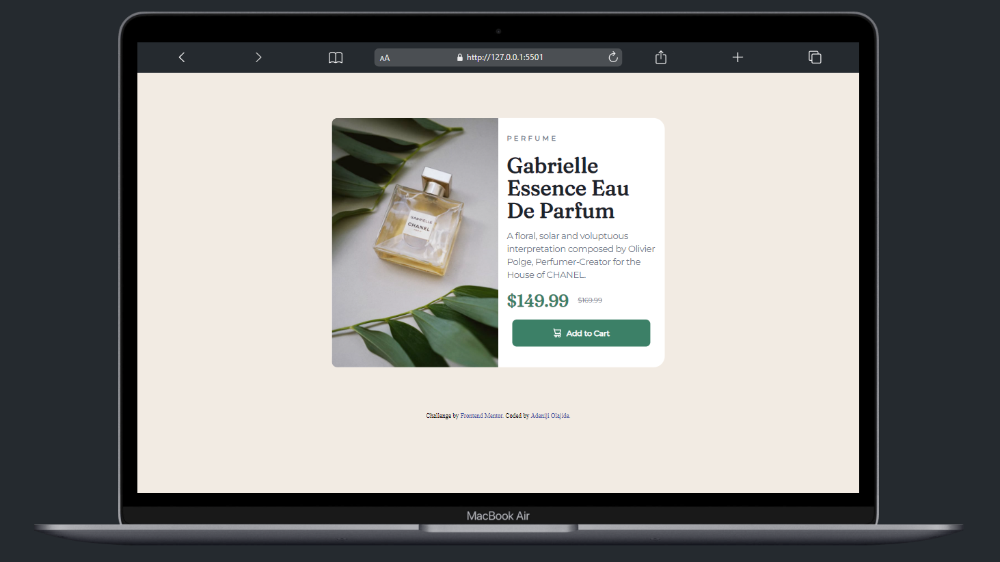
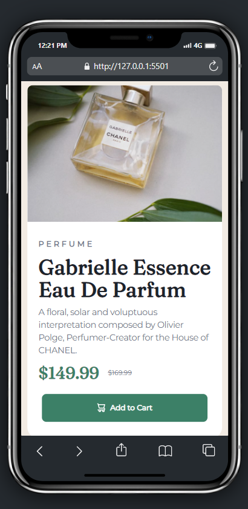

# Frontend Mentor - Product preview card component solution

This is a solution to the [Product preview card component challenge on Frontend Mentor](https://www.frontendmentor.io/challenges/product-preview-card-component-GO7UmttRfa). Frontend Mentor challenges help you improve your coding skills by building realistic projects. 

## Table of contents

- [Overview](#overview)
  - [Screenshot](#screenshot)
  - [Links](#links)
- [My process](#my-process)
  - [Built with](#built-with)
- [Author](#author)


## Overview

Users should be able to:

- View the optimal layout depending on their device's screen size
- See hover and focus states for interactive elements

### Screenshot







### Links

- Solution URL: [solution URL here](https://www.frontendmentor.io/solutions/this-is-a-responsive-landing-page-using-media-query-xJKaGye_4u)
- Live Site URL: [Click to view page](https://goldenthrust.github.io/product-preview-card-component-main/)

## My process

### Built with

- Semantic HTML5 markup
- CSS custom properties

## Author

- Website - [Adeniji Olajide](https://www.facebook.com/sluggish.superstition.5)
- Frontend Mentor - [GoldenThrust](https://www.frontendmentor.io/profile/GoldenThrust)
- Twitter - [@Goldenthrust3](https://www.twitter.com/Goldenthrust3)
- Instagram - [Imagination_purely](https://www.instagram.com/imagination_purely)
- GitHub - [GoldenThrust](https://github.com/GoldenThrust)

I am ``` Just testing ``` this ``` ok ```
